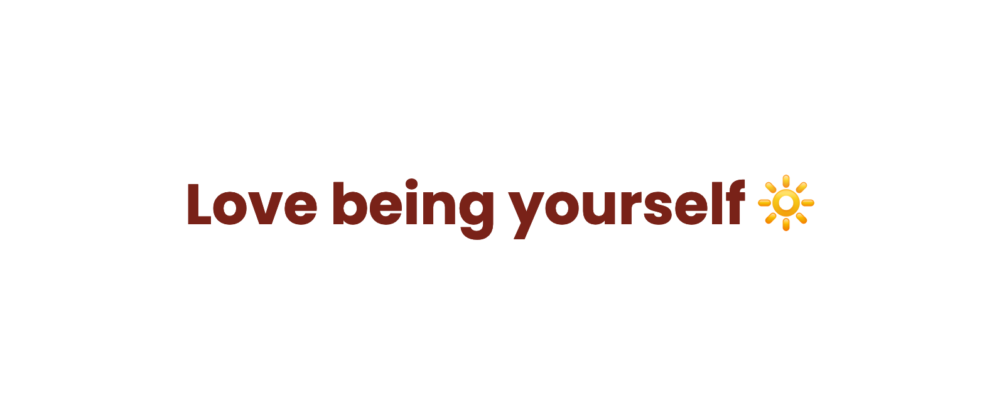

#  4F 69 0D 0A 

 

    

 

- 🖐🏻 &nbsp; Pronomes: ela/dela (she/her) | | elu/delu (they/them).
- 🎓 &nbsp; Graduada com Honra Láurea em Tecnologia de Análise e Desenvolvimento de Sistemas em Dracena.
- 💫 &nbsp; Tenho interesse em RPGs, Visual Novels, Jogos Mobiles, UX Design & UX Writing. 
- 🍀 &nbsp; Meus hobbys são assistir animes, ler, jogar, escrever e desenhar. 
- 💛 &nbsp; Posso colaborar em ONGs, me mande uma mensagem sobre seu projeto! 
- 📖 &nbsp; Atualmente me aprofundando em React Native.
- 🎀 &nbsp; <a href="https://github.com/TatianaMatumoto/curriculum"> Currículo Multipotencial. </a>
- 💻 &nbsp; <a href="https://github.com/TatianaMatumoto/curriculum-tech"> Currículo focado em tecnologia. </a>

<!--  -->

<samp> 
    . ..- / --. --- ... - --- / -.. . / .- .--. .-. . -. -.. . .-. / .- ... ... ..- -. - --- ... / ...- .- .-. .. .- -.. --- ... 
</samp>
 
  
   
## 📚 &nbsp; Conhecimentos

 
  
  
  
  
  
  
  
  
  
     
  

    

 

## 🕵🏻‍♀️  &nbsp; Estou aprendendo: 

 
    
  
  
  
   
  

    

## 👩🏻‍💻 &nbsp; Estou interessada em aprender: 

 
  
   

    

 

## ✨ &nbsp; Status 

    

        
        

    

 

 

  <!-- 
 ## 💫 &nbsp; Sigam-me

     
      

-->
  
  
